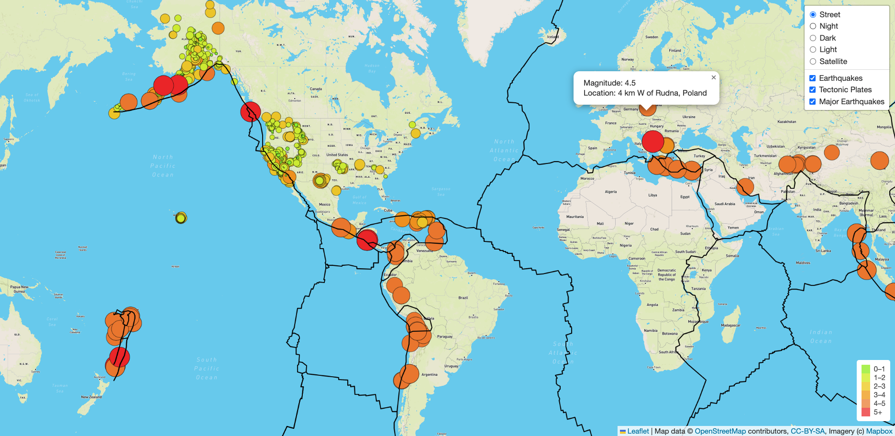

# Mapping_Earthquake

## Overview
The purpose of this project is to create an interactive map with earthquakes information. It visually shows the differences between the magnitudes of earthquakes all over the world for the last seven days. We used a URL for GeoJSON earthquake data from the USGS website and retrieve geographical coordinates and the magnitudes of earthquakes for the last seven days. Then add the data to a map.

## Approach
We used the JavaScript and the D3.js library to retrieve the coordinates and magnitudes of the earthquakes from the GeoJSON data. Besides, we use the Leaflet library to plot the data on a Mapbox map through an API request and create interactivity for the earthquake data.

## Result
Feel free to visit our interactive webpage with earthquakes information. 
https://yycheung.github.io/Mapping_Earthquake/

